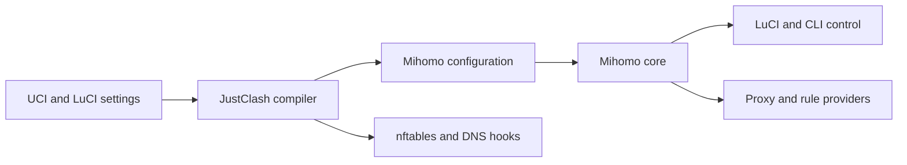
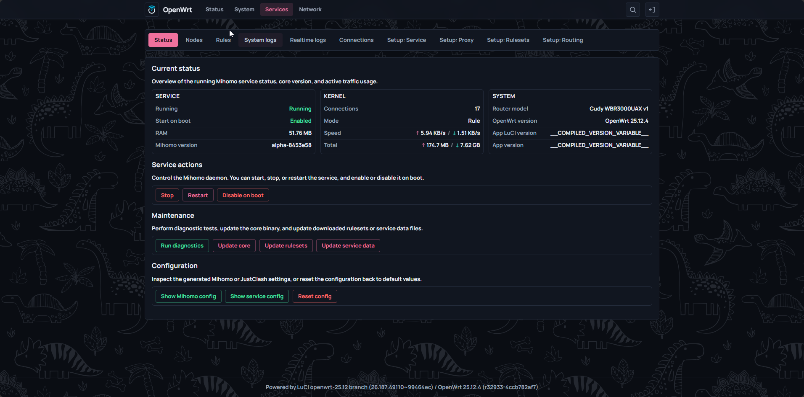
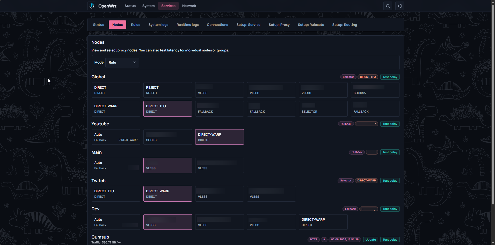
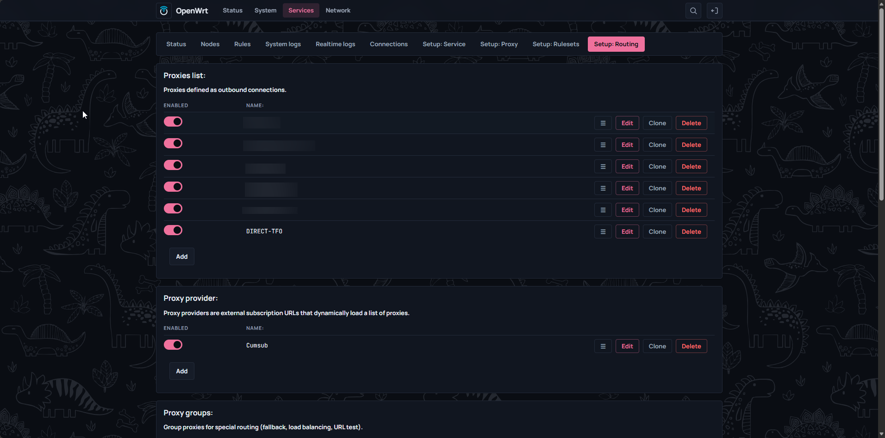
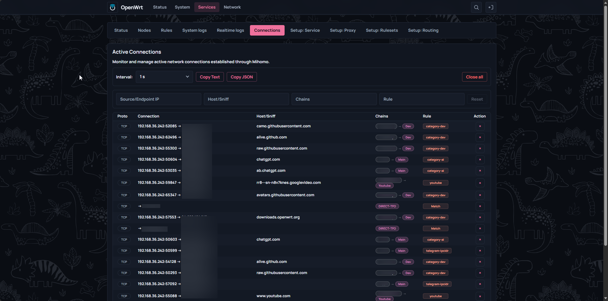
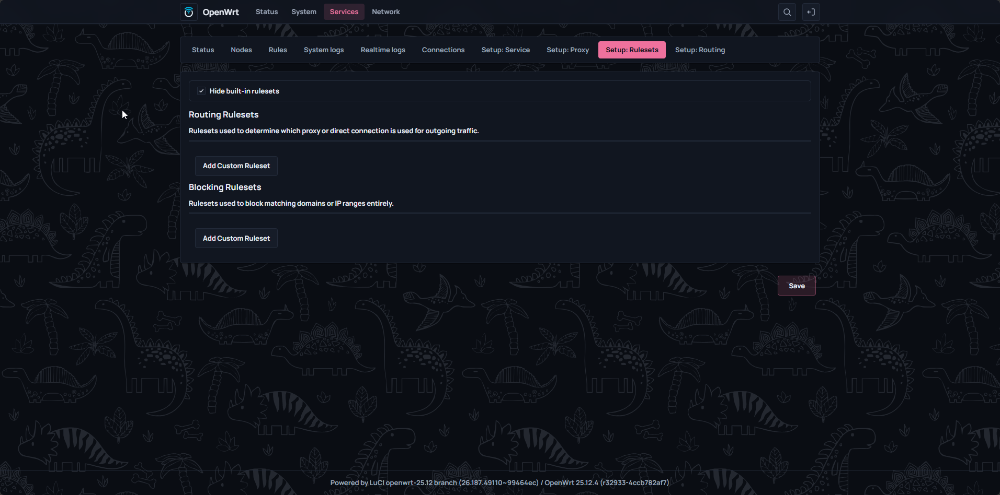
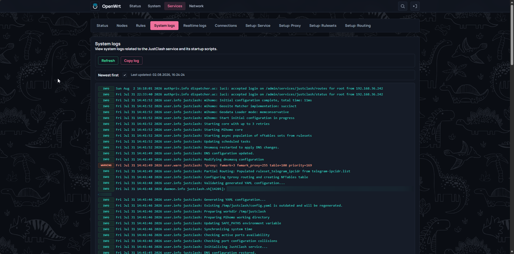
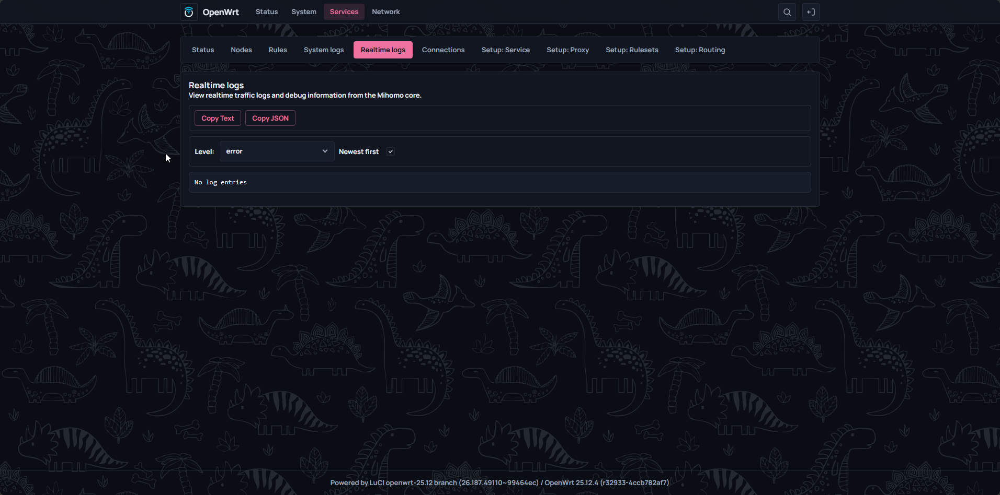

<h1 align="center">JustClash</h1>

  
  
   
  
  
  

  

  Native OpenWrt traffic orchestration service and LuCI interface for managing Mihomo routing, outbounds, and lifecycle—without requiring a third-party dashboard.

  <a href="info/00_quick_start.md">Quick start</a> ·
  <a href="info/00_routing_architecture_and_design.md">Routing architecture</a> ·
  <a href="info/10_security_concerns.md">Security concerns</a> ·
  <a href="info/12_update_backup_remove.md">Update / backup / remove</a> ·
  <a href="info/01_uci-structure.md">UCI reference</a> ·
  <a href="DISCLAIMER.md">Disclaimer</a>

> [!IMPORTANT]
> JustClash manages local routing and runtime configuration. It does not provide remote servers, subscriptions, access credentials, or preconfigured external routing destinations.

> [!CAUTION]
> **Disclaimer / Отказ от ответственности**
>
> This non-commercial educational and technical research project is provided “AS IS”. Read the full bilingual [Disclaimer / Отказ от ответственности](DISCLAIMER.md), including compliance, liability, and trademark terms, before use.

## About

JustClash connects OpenWrt's native UCI configuration system with the Mihomo runtime. It compiles router settings into a working core configuration, manages the service lifecycle, and installs the required firewall and DNS hooks.

The LuCI application provides service controls, node selection, active connections, rules, traffic statistics, and realtime logs. The service can also be managed entirely through UCI, init scripts, and the command line.

## Highlights

| Capability | Description |
| --- | --- |
| Native OpenWrt integration | UCI configuration, procd supervision, fw4/nftables hooks, and LuCI CSR views |
| Full and partial routing | Choose complete traffic interception or selective lower-overhead routing |
| Runtime control | Switch nodes, inspect rules and connections, terminate sockets, and view live logs |
| Mihomo-native providers | Proxy providers and rule providers are downloaded and updated by the core |
| APK and IPK packages | OpenWrt 25.x is the primary APK target; OpenWrt 24.x remains supported through IPK |
| Headless management | LuCI is optional for users who prefer UCI and CLI administration |

## Getting Started

1. Follow the [Quick Start](info/00_quick_start.md) to install the packages and create the first outbound.
2. Read [Choosing a Routing Mode](info/00_routing_architecture_and_design.md) before selecting full or partial routing.
3. Use the [UCI structure reference](info/01_uci-structure.md) for manual configuration.

The online installer detects the router package manager automatically. Interactive installation asks only which translation package should be installed; automated installation uses the English LuCI package without an additional translation.

## Documentation

### Core Reference

| Guide | Covers |
| --- | --- |
| [Quick Start](info/00_quick_start.md) | Installation, routing mode, outbounds, groups, and first launch |
| [Routing Architecture](info/00_routing_architecture_and_design.md) | Full and partial routing, DNS, Fake-IP, TProxy, TUN, IPv6, and mode changes |
| [Security Concerns](info/10_security_concerns.md) | Generated API passwords, download User-Agents, controller exposure, TLS, dashboards, and CORS |
| [Update, Backup, and Removal](info/12_update_backup_remove.md) | Package and core updates, SHA256 verification, backup, restore, rollback, and removal |
| [UCI Configuration](info/01_uci-structure.md) | Complete configuration structure and section reference |

### Routing and Rules

| Guide | Covers |
| --- | --- |
| [Traffic Exclusions](info/04_service_traffic_exclusion.md) | Router and LAN bypass rules by mark, owner, address, port, or client |
| [User-Defined RuleSets](info/05_user_defined_rulesets.md) | Custom sources, activation, caching, and partial-routing requirements |
| [Block Rules](info/06_block_rules.md) | Domain and address blocking, limitations, and verification |
| [Geodata, Geosite, and GeoIP](info/11_geodata_and_geoip.md) | Policy types, update sources, Fake-IP filters, and verification |

### Network Scenarios

| Guide | Covers |
| --- | --- |
| [Mixed Port](info/07_mixed_port.md) | HTTP/SOCKS listener setup, client configuration, and security |
| [Guest Network](info/08_use_guest_network.md) | Intercepted or direct guest networks and filtered DNS |
| [Multi-WAN and Failover](info/09_multiwan_balancing_failover.md) | Interface binding, failover, latency selection, and balancing |

### Operations and Security

| Guide | Covers |
| --- | --- |
| [Startup and WAN Troubleshooting](info/03_startup_and_wan_issues.md) | WAN readiness, delayed startup, time synchronization, and recovery order |

## Architecture

The service owns the complete lifecycle: validation, configuration compilation, firewall setup, core supervision, and cleanup. More detail is available in [Routing Architecture](info/00_routing_architecture_and_design.md).

## Screenshots

  

Interface gallery

| Nodes | Routing |
| --- | --- |
|  |  |

| Connections | Rulesets |
| --- | --- |
|  |  |

| Service logs | Realtime logs |
| --- | --- |
|  |  |

## Compatibility

Supports OpenWrt 24.x (OPKG/IPK) and 25.x (APK). See the [Quick Start](info/00_quick_start.md) for installation instructions.

## License

Licensed under the [GPL-2.0 License](LICENSE).
