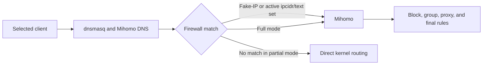

# Choosing a Routing Mode

JustClash supports two interception modes. The choice determines which connections reach Mihomo; rules inside Mihomo cannot affect traffic that the firewall never intercepted.

## Quick Decision

Choose **Partial Interception** when:

- only selected domains or address lists should enter Mihomo;
- most traffic should remain in the kernel fast path;
- the router has limited CPU or memory;
- unmatched real-address connections may remain direct.

Choose **Full Interception** when:

- every selected connection must be evaluated by Mihomo;
- the default rule must affect all selected traffic;
- raw-address applications must follow GEOIP or IP rules;
- complete connection visibility is required.

## Data Path



DNS selects domain traffic for the Fake-IP path. In Partial Interception, nftables additionally selects real-address traffic from active `ipcidr/text` rulesets. Binary IP-CIDR or GeoIP databases are not converted into kernel sets.

## Behavior Comparison

| Behavior | Partial Interception | Full Interception |
| --- | --- | --- |
| Fake-IP domain traffic | Intercepted | Intercepted |
| Active `ipcidr/text` rulesets | Synchronized to nftables and intercepted | Evaluated by Mihomo |
| Binary IP-CIDR rulesets | Do not capture otherwise-unmatched raw addresses | Evaluated by Mihomo |
| Unmatched real-address traffic | Direct kernel routing | Evaluated by Mihomo |
| Final `MATCH` rule | Intercepted traffic only | All selected traffic |
| Raw-address GEOIP policy | Incomplete | Available |
| Dashboard visibility | Intercepted connections only | All selected connections |
| Typical resource use | Lower | Higher |

## Partial Interception

Partial mode creates nftables sets from enabled text IP-CIDR rulesets and intercepts:

- connections to configured Fake-IP ranges;
- destinations contained in active IPv4 or IPv6 text sets;
- traffic selected by explicit JustClash firewall handling.

Everything else remains outside Mihomo.

Consequences:

1. A proxy default rule cannot capture an unmatched real-address connection.
2. A domain excluded from Fake-IP may go direct unless its real addresses are present in an active text IP-CIDR set.
3. A binary `.mrs` IP-CIDR provider can classify traffic already inside Mihomo, but cannot populate the Partial Interception nftables sets.
4. Connections that bypass Mihomo do not appear in its connection list.

The ruleset worker watches active text IP-CIDR files and updates nftables after Mihomo refreshes them. Domain and binary rulesets remain core-side data.

## Full Interception

Full mode redirects traffic from selected client interfaces to Mihomo. Router-originated traffic is controlled separately.

Use it for:

- proxy or block defaults that must apply to all selected connections;
- raw-address GEOIP policy;
- complete per-client observability;
- policies whose ordering must be identical for domain and address traffic.

The trade-off is additional userspace processing. Exclude only traffic that must stay in the native path; disabling random nftables rules merely produces a network that is broken in a more creative way.

## DNS and Fake-IP

When DNS management is enabled, dnsmasq forwards the relevant requests to Mihomo. Mihomo can return a Fake-IP address, and the following client connection is mapped back to the original domain.

The DNS path and traffic path must agree:

| Client design | DNS result | Traffic path |
| --- | --- | --- |
| Intercepted client | Fake-IP allowed | Must enter JustClash |
| Fully bypassed client | Real addresses | Must remain outside JustClash |
| Partially bypassed domain | Real address | Needs an active text IP-CIDR set if it must still be proxied |

See [Traffic Exclusions](04_service_traffic_exclusion.md) and [Guest Network Configuration](08_use_guest_network.md).

## TProxy, Not TUN

JustClash uses fw4/nftables, policy routing, and TProxy. It does not create a virtual TUN interface.

The managed components are:

1. nftables interception and exclusion rules;
2. IPv4 and optional IPv6 policy-routing tables;
3. Mihomo listeners, DNS, and routing rules.

Stop or reload the service through procd so all three components are updated together.

## Client and Router Traffic

| Traffic source | Main control |
| --- | --- |
| Forwarded clients | **Set traffic rules at startup** and **Client traffic interfaces** |
| Router processes | **Set router traffic rules at startup** |
| Selected bypasses | Client address, MAC, port, socket owner, or routing mark |

Mihomo outbound sockets use a dedicated mark to prevent interception loops.

## IPv6

When IPv6 support is enabled and the router has a usable IPv6 WAN:

- JustClash creates IPv6 interception and policy-routing rules;
- Partial Interception maintains IPv6 sets for supported text IP-CIDR sources;
- IPv6 Fake-IP can be enabled in the generated DNS configuration.

When IPv6 support is disabled or unavailable, IPv6 traffic is not governed by the IPv4 rules. Test IPv4 and IPv6 separately.

## Change Modes Safely

1. Stop high-volume transfers.
2. Open **Services → JustClash → Setup: Service → Traffic rules**.
3. Change **Routing mode**.
4. Review the default rule, Fake-IP exclusions, and selected client interfaces.
5. Save & Apply.
6. Check **Connections**, **Rules**, and **System logs**.
7. Run:

```sh
justclash.sh diag_nft
justclash.sh diag_route
```

These diagnostics may include local network data. Use `justclash.sh diag_redacted` when the result will be shared.

If Full Interception overloads the router, return to Partial Interception or add a narrow exclusion. A random chain deletion is not a rollback strategy.
