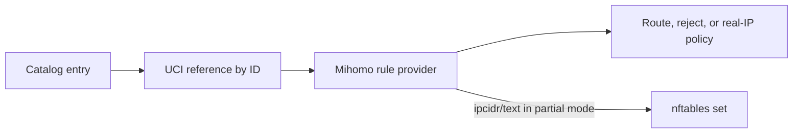

# User-Defined Rulesets

A ruleset catalog entry defines a source. It becomes active only when an enabled proxy, group, block section, or Fake-IP filter references its ID.

## Lifecycle



Creating the catalog entry alone does not download or apply it.

## Add an Entry in LuCI

Open **Services → JustClash → Setup: Rulesets**.

1. Select the routing or blocking catalog.
2. Add a row.
3. Set a display name and stable unique ID.
4. Choose the content type and format.
5. Enter a remote URL or absolute local path.
6. Add authorization only when the source requires it.
7. Save the row and Save & Apply.
8. Open **Setup: Routing** and reference the ID.

Changing an ID requires updating every reference. Renaming only the display name does not.

## Supported Sources

| Content | Format | Mihomo provider | Partial nftables synchronization |
| --- | --- | --- | --- |
| `domain` | `mrs` | Yes | No |
| `ipcidr` | `mrs` | Yes | No |
| `ipcidr` | `text` | Yes | Yes |

Text domain lists are not accepted by this catalog. Partial Interception requires `ipcidr/text` when otherwise-unmatched raw-address traffic must be captured by nftables.

## Manual Catalog Files

| Purpose | File |
| --- | --- |
| Routing rulesets | `/etc/justclash/user.rulesets.txt` |
| Blocking rulesets | `/etc/justclash/user.block.rulesets.txt` |

Each non-comment line uses:

```text
Name|ID|Type|Format|URL_or_Path[|Authorization]
```

| Field | Requirement |
| --- | --- |
| `Name` | Human-readable label |
| `ID` | Stable unique identifier |
| `Type` | `domain` or `ipcidr` |
| `Format` | `mrs`, or `text` for `ipcidr` |
| `URL_or_Path` | Direct HTTP(S) source or absolute local path |
| `Authorization` | Optional complete Authorization header value |

Templates:

```text
Remote domains|remote-domains|domain|mrs|<RULESET_URL>
Local networks|local-networks|ipcidr|text|/etc/justclash/local-networks.list
Protected source|protected-source|domain|mrs|<RULESET_URL>|<AUTHORIZATION_HEADER>
```

The fields cannot contain a pipe or newline. Authorization data is a credential; protect the file and never include its raw line in diagnostics.

## Activate an Entry

| Policy | UCI reference |
| --- | --- |
| Route through an individual proxy | `proxies.enabled_list` |
| Route through a proxy group | `proxy_group.enabled_list` |
| Block | `block_rules.enabled_blocklist` |
| Return real addresses for matching domains | `proxy.fake_ip_exclude_rulesets` |

The reference uses the catalog ID, not its display name.

## Download Path

Active remote rulesets are downloaded by Mihomo. The target proxy/group section controls:

- the outbound used for downloads;
- update interval;
- size limit.

For blocklists, `block_rules.proxy` also selects the download outbound. It does not change the generated `REJECT` action.

## Local Files

Use an absolute path. The file must:

- be readable by the Mihomo process;
- use the declared format and behavior;
- remain available for the lifetime of the service;
- reside in an intended safe directory.

Do not place frequently updated files on flash unless persistence is required.

## Partial Interception

For an `ipcidr/text` source:

1. Mihomo downloads or opens the list.
2. JustClash records it as an active IP-CIDR source.
3. The ruleset worker watches for updates.
4. Valid address entries are synchronized into nftables sets.

A binary `.mrs` address provider remains useful inside Mihomo but cannot capture a raw-address connection that never entered the core.

## Persistence

`mihomo_persistent_ext_rules` moves downloaded rules from RAM-backed storage to persistent storage.

Enable it only when:

- lists must survive reboot;
- enough persistent space exists;
- additional flash writes are acceptable.

Otherwise the rules are downloaded again after reboot.

## Verification

```sh
service justclash restart
justclash.sh logs 100
justclash.sh diag_nft
```

| Symptom | Check |
| --- | --- |
| ID is absent from Routing | Catalog syntax and duplicate IDs |
| Provider is not downloaded | The ID is not referenced by an enabled section |
| Remote fetch fails | WAN, system time, authorization, and selected download outbound |
| Partial mode ignores raw addresses | Source must be active `ipcidr/text` |
| Update is not visible | Restart/reload after manual catalog edits |

Use `diag_redacted` for shared diagnostics. Catalog URLs and authorization fields may be sensitive.

## Remove an Entry

1. Remove every UCI reference to its ID.
2. Save & Apply.
3. Remove the catalog row.
4. Apply again and verify that the provider disappeared.

Removing the catalog first leaves stale references that UCI will preserve with admirable indifference.
