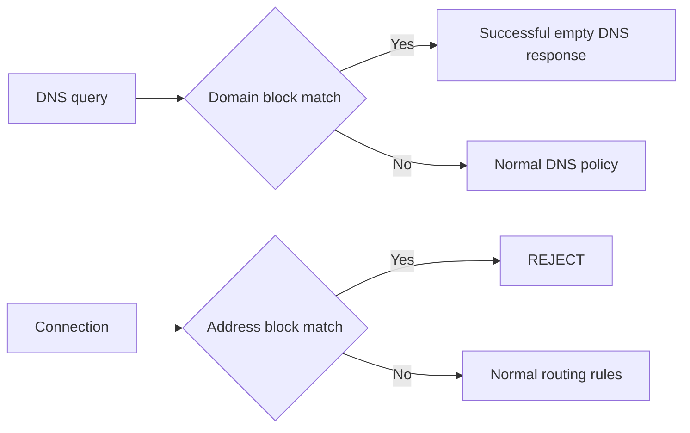

# Block Rules

JustClash blocks domains through Mihomo DNS policy and blocks addresses through high-priority routing rules. The generated action is `REJECT`.

> [!IMPORTANT]
> `block_rules.proxy` selects the outbound used to download blocklist files. It is not the block action and should not be set to `REJECT`.

## Enable Blocking in LuCI

Open **Services → JustClash → Setup: Routing → Block rules**.

1. Enable the section.
2. Select the required blocklist IDs.
3. Choose how lists should be downloaded under **Download lists through**.
4. Configure update interval and size limit.
5. Add manual domain or IPv4 CIDR entries when needed.
6. Save & Apply.

Catalog entries are managed under **Setup: Rulesets**. See [User-Defined Rulesets](05_user_defined_rulesets.md).

## Minimal UCI Configuration

```sh
uci set justclash.block_rules=block_rules
uci set justclash.block_rules.enabled='1'
uci add_list justclash.block_rules.enabled_blocklist='<BLOCKLIST_ID>'
uci commit justclash
service justclash restart
```

To select a download path explicitly:

```sh
uci set justclash.block_rules.proxy='<DOWNLOAD_OUTBOUND>'
```

Use `DIRECT` or an existing proxy/group name. This affects provider downloads only.

## Manual Entries

### Domain Suffix

```sh
uci add_list justclash.block_rules.additional_domain_blockroute='<DOMAIN_SUFFIX>'
```

### IPv4 Address or CIDR

```sh
uci add_list justclash.block_rules.additional_destip_blockroute='<IPV4_OR_CIDR>'
```

```sh
uci commit justclash
service justclash restart
```

## How Blocking Is Applied



### Domain Matches

Domain blocklists, Geosite block categories, and manual suffixes are added to DNS policy. Matching queries receive a successful empty response instead of a routable address.

This requires the client to use the JustClash-managed DNS path. Applications using their own external or encrypted resolver can bypass domain-level DNS blocking.

### Address Matches

Address blocklists, GeoIP block categories, and manual IPv4 entries produce high-priority `REJECT` rules.

In Partial Interception, an active `ipcidr/text` blocklist can also populate nftables sets so raw-address traffic reaches Mihomo. Binary address providers cannot capture otherwise-unmatched raw connections.

## Rule Order

Block rules are emitted before:

- proxy-group routing rules;
- individual proxy rules;
- the final rule.

Mixed-port fixed-outbound handling is also high priority. Use `BY RULES` when explicit proxy clients must receive normal block policy.

## Limitations

- Firewall-excluded clients never reach Mihomo block rules.
- Domain blocking does not control applications bypassing the managed DNS path.
- Partial Interception needs an active text address list to capture raw-address traffic.
- Manual address blocking is IPv4-only in the current UCI field.
- Large overlapping lists increase memory use and refresh work.
- Fake-IP exclusions and nameserver policy can change which DNS rule sees a domain.

## Verification

```sh
justclash.sh logs 100
justclash.sh diag_nft
```

Verify:

1. selected providers are loaded;
2. block rules appear before normal routing rules;
3. a permitted test entry produces the expected DNS or connection result;
4. the test client uses the managed DNS path;
5. IPv4 and IPv6 behavior are checked separately.

Do not publish the tested domain, client address, or raw diagnostic output. Use `diag_redacted` for support.

## Disable or Remove

```sh
uci set justclash.block_rules.enabled='0'
uci commit justclash
service justclash restart
```

Disable first and verify service behavior before deleting list references or catalog entries.
